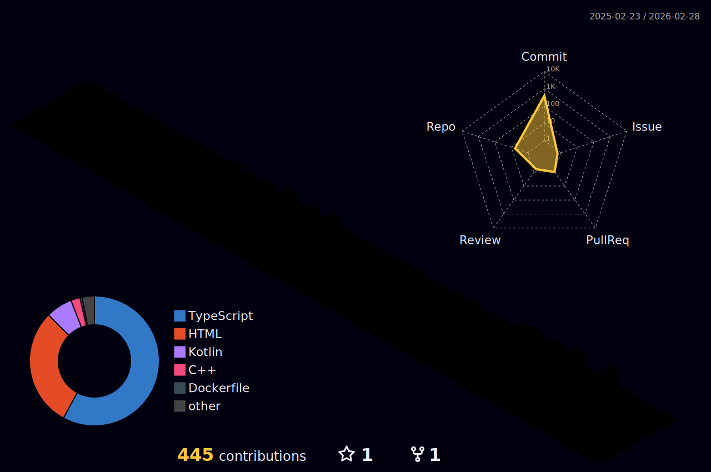

<div align="center">
  
<!-- Animated Header -->


<!-- Typing SVG -->
<a href="https://git.io/typing-svg"></a>

<!-- Profile Views & Followers -->
<br/>


</div>

<!-- About Me Section -->
##  About Me

```typescript
const samuel: Developer = {
    name: "Samuel Guzmán",
    role: "Full Stack Developer & Computer Engineering Student",
    location: "🌎 Building from anywhere",
    
    strengths: [
        "Clean Architecture Enthusiast",
        "Problem Solver with Logic-First Approach", 
        "Team Leader & Collaborative Developer",
        "Hackathon Participant 🚀",
        "Perfectionist"
    ],
    
    currentlyLearning: "Always exploring new technologies",
    funFact: "I turn Coca-Cola into code and ideas into reality 🥤→💻"
};
```

<br/>

<!-- 3D Contribution Calendar -->
##  3D Contribution Calendar

<div align="center">
  <picture>
    <source media="(prefers-color-scheme: dark)" srcset="./profile-3d-contrib/profile-night-rainbow.svg" />
    <source media="(prefers-color-scheme: light)" srcset="./profile-3d-contrib/profile-night-rainbow.svg" />
    
  </picture>
</div>

<br/>

<!-- Snake Animation -->
##  Contribution Snake

<div align="center">
  <picture>
    <source media="(prefers-color-scheme: dark)" srcset="https://raw.githubusercontent.com/notoriussss/notoriussss/output/github-snake-dark.svg" />
    <source media="(prefers-color-scheme: light)" srcset="https://raw.githubusercontent.com/notoriussss/notoriussss/output/github-snake.svg" />
    
  </picture>
</div>

<br/>

<!-- Tech Stack -->
##  Tech Arsenal

<div align="center">

### 💻 Languages


### 🎨 Frontend


### ⚙️ Backend


### 🗄️ Databases


### 🛠️ Tools & Platforms


### 🎮 Game Dev & Design


### 🔌 IoT & Hardware


### 📡 APIs & Integration


</div>

<br/>


<!-- Quote -->
## 💭 Dev Quote of the Day

<div align="center">
  
</div>

<br/>

<!-- Footer -->
<div align="center">
  
</div>

<div align="center">
  <sub>⚡ Crafted with passion by Samuel Guzmán | Building the future, one commit at a time</sub>
</div>
